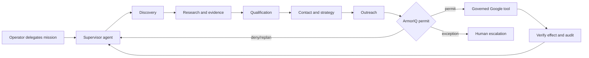

# ArmorIQ Partner Development Agent

An autonomous, evidence-grounded partner-development system. Operators delegate a mission and limits once; specialized agents discover, research, qualify, contact, converse, and schedule. ArmorIQ authorizes each consequential action at runtime and the application verifies the authorization immediately before execution.

The system is not a bulk-email tool. A scheduler may start work, but it cannot grant authority. Gmail, Calendar, Drive, and Docs actions fail closed unless an unexpired ArmorIQ permit matches the agent, mission, operation, target, payload hash, limits, and idempotency key.

## Local development

Requirements: Docker with Compose, or Python 3.12, Node 22, and PostgreSQL 16.

```bash
cp .env.example .env
docker compose up --build -d
make migrate
make seed
make test
make smoke
```

`ARMORIQ_MODE=mock` and `MODEL_MODE=deterministic` are development-only. Live mode uses `MODEL_MODE=openai`, `OPENAI_API_KEY`, `ARMORIQ_MODE=remote`, `ARMORIQ_API_KEY`, stable ArmorIQ user and agent IDs, and `ARMORIQ_FAIL_CLOSED=true`. The official ArmorIQ SDK enforces each tool call and reports its result. The `mcp` service exposes the local adapter for ArmorIQ registration; live registration requires a public HTTPS `MCP_SERVER_URL`.

Each specialist is a concrete class in `backend/app/specialists/` with its own system instructions, Pydantic input/output contract, allowed tool, and token/input budget. The supervisor routes state transitions; it does not implement or switch over specialist behavior. OpenAI calls use the typed Responses API boundary in `backend/app/model_gateway.py`. In live mode, discovery, company research, and public contact sourcing use OpenAI's built-in web search; no seed-company list or separate search-provider key is required. Every proposed external action still requires a payload-bound ArmorIQ permit.

### Editing agent prompts

All model instructions are plain Markdown files in `backend/app/agent_prompts/`. Specialist code stores only the prompt asset name; the validated prompt loader resolves and caches the file. This makes prompt changes reviewable independently from schemas and tool authority. Restart the backend after editing a prompt so the process reloads the cached asset. The architecture tests require every agent to reference an existing prompt and every prompt file to be used by an agent.

## Agentic workflow



Humans remain responsible for mission definition, credentials, policy-envelope changes, and exceptional escalations. They do not approve routine per-action execution.

## Production deployment

Follow [GitHub-to-GCP deployment](docs/GITHUB_GCP_DEPLOYMENT.md), [Deployment](docs/DEPLOYMENT.md), [Google Workspace setup](docs/GOOGLE_WORKSPACE_SETUP.md), and [ArmorIQ integration](docs/ARMORIQ_INTEGRATION.md). Production is private by default and intended for Google-identity-authenticated operators.

## Documentation

- [Architecture](docs/ARCHITECTURE.md)
- [Threat model](docs/THREAT_MODEL.md)
- [Runbook](docs/RUNBOOK.md)
- [Admin guide](docs/ADMIN_GUIDE.md)
- [User guide](docs/USER_GUIDE.md)
- [Costs and limitations](docs/COSTS_AND_LIMITATIONS.md)
- [Implementation plan](IMPLEMENTATION_PLAN.md)
