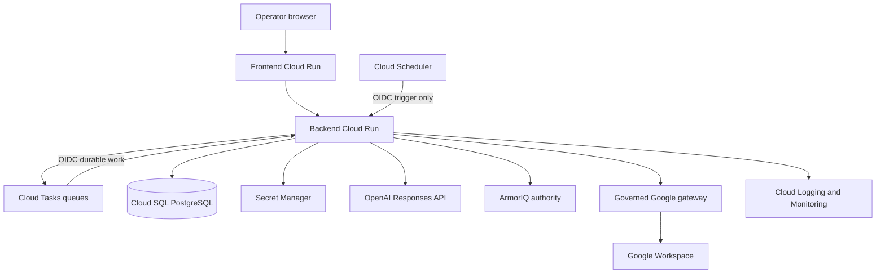
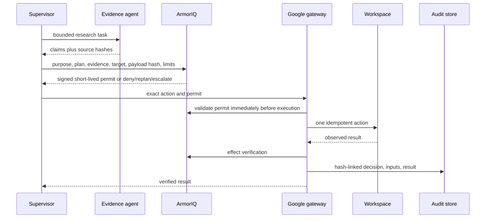

# Architecture

## Runtime

The supervisor owns the workflow, not unrestricted tools. Specialists emit typed proposals and evidence. Before an external effect, the gateway captures purpose, commits the exact plan, uses the ArmorIQ SDK to mint an intent token and check the tool call, validates the action-bound application permit, executes once, reports the observed result through the SDK, and persists both ArmorIQ and application audit evidence. The present adapters execute locally, while a separate authenticated MCP façade exposes their fixed inventory for ArmorIQ registration and future proxy execution.

## Specialist isolation

Specialists are separate concrete modules for discovery, research, evidence, qualification, contacts, strategy, outreach, conversation, scheduling, and meeting preparation. Every execution class owns one prompt, one strict output schema, one least-privilege tool allowlist, one input/output budget, and one state transition. A shared base class provides only lifecycle mechanics (typed model call, ArmorIQ request, permit handling, audit, and state persistence); it contains no pipeline-step output dispatch.

Prompt text lives separately in `backend/app/agent_prompts/*.md`. Specs refer to prompt names rather than embedding instructions, and the central loader validates names, rejects path traversal, rejects empty prompts, and caches successful reads. Tests enforce a one-to-one inventory: no agent may lack a prompt asset and no orphan prompt asset may exist.

Production model generation uses the OpenAI Responses API with Pydantic structured outputs and `gpt-5.6-sol`. Source material is serialized as untrusted JSON and cannot supply instructions. Local tests select the explicit deterministic model adapter, which returns the same specialist-owned contracts and enforces the same input budgets without making network calls.

## Data flow

## Trust boundaries

Public web content is untrusted data, never instructions. Browser, model, scheduler, task payload, Google responses, and external APIs cross explicit validation boundaries. Secrets remain in Secret Manager; OAuth tokens are encrypted at rest. Production defaults to private Cloud Run invocation and fail-closed authorization.
